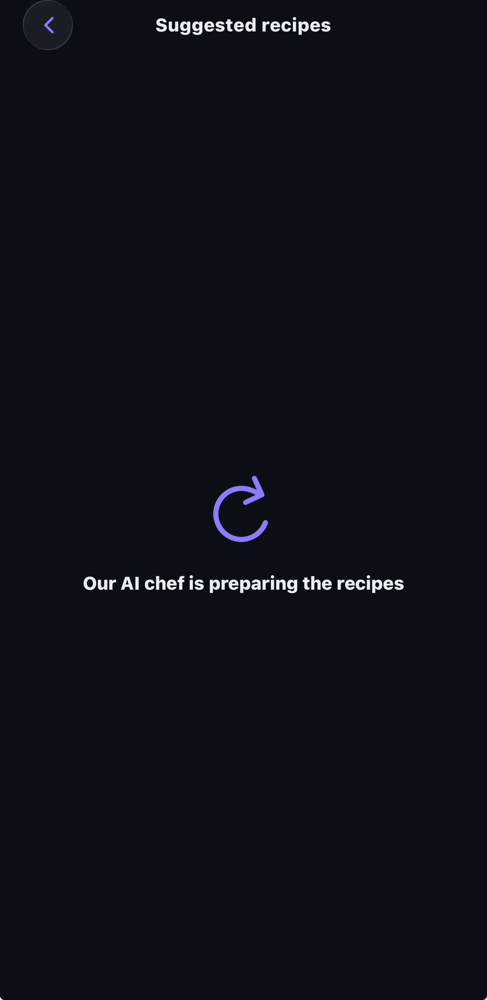
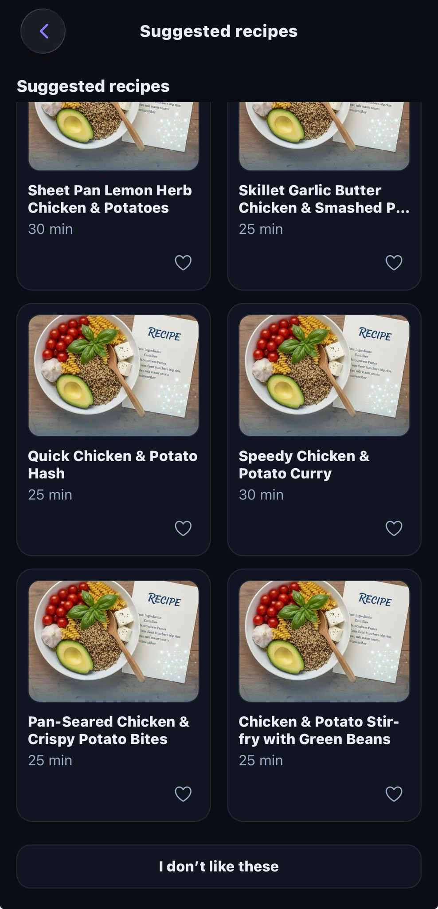
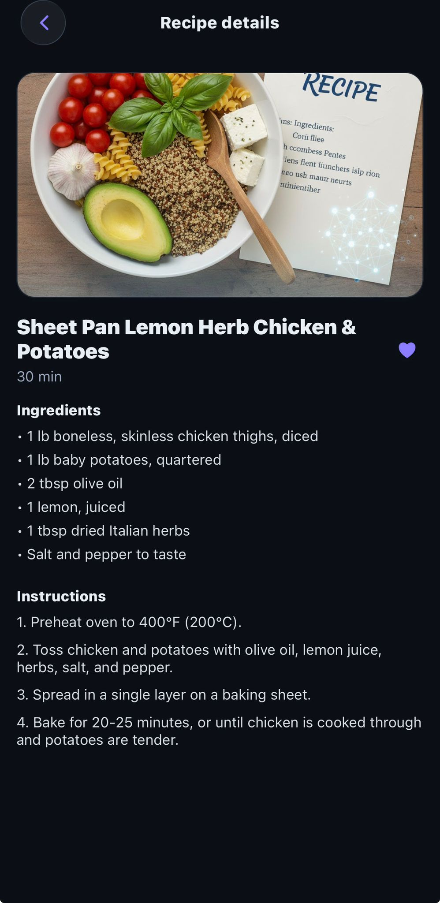

# recipes.ai — Expo + React Native

Type what you feel like eating; it generates 6 recipes via Gemini. Save favorites.

## Setup
1) Open `app.json` and set `YOUR_GEMINI_API_KEY` to your Gemini key (starts with AIza…)
2) Install deps and run:
npm i and
npx expo start -c

## Preview

### Landing
Generate recipe ideas from a simple prompt.

### Searching
Type on the search field any ideas

### Loading
A lightweight loader while results are prepared.

### Results
Six AI-generated options to choose from. If you don't like the you can click the button on the buttom and those will be generated again.

### Detail
Full recipe view with ingredients and steps.

### Add to favorites
One tap to store a recipe you like.

### Favorites
Save and revisit your favorite recipes.

